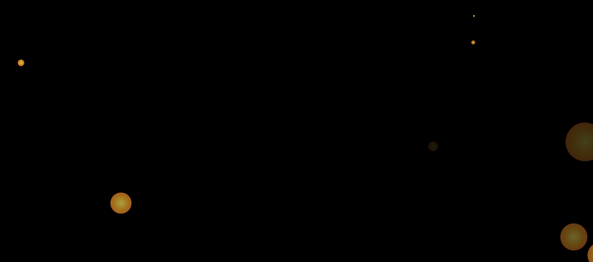

# Bubbles Particle Theme

This project creates a dynamic particle animation effect that generates floating bubbles with vibrant colors across the screen. The particles are designed to appear randomly with different sizes, positions, and colors.

## Features
- **Dynamic Particle Generation**: Randomly sized particles appear and float across the screen.
- **Color Variations**: Particles have randomized colors using HSL values and radial gradients.
- **Performance Optimization**: Limits the number of particles to ensure smooth performance.

## Usage
Simply open the `index.html` file in any modern web browser to see the animated bubbles effect.

## How It Works
1. **Particle Creation**:
   - The `particles` function generates new particle elements (`span`) at random positions on the screen.
   - Each particle has a random size, position, and color.
2. **Animation**:
   - Particles animate with a radial scale and rotation effect, moving outward while fading away.
3. **Cleanup**:
   - To maintain performance, only up to 100 particles are allowed on the screen at a time. Older particles are removed after a random lifetime.

## Demo

## How to Customize
- Modify the CSS classes to change particle appearance, animation speed, or background.
- Adjust the JavaScript logic to fine-tune particle behavior or appearance settings.
- Add or modify animations by updating the `@keyframes animate` rule.

## Future Enhancements
- **Customization Options**: Add more configuration options such as particle speed, color schemes, and shapes.
- **Interactive Features**: Introduce mouse interactions like clicking to add particles or pausing/resuming the animation.
- **Performance Optimization**: Improve performance by optimizing the particle removal logic and reducing the number of particles if needed.
- **Mobile Support**: Ensure compatibility with mobile devices by adapting the layout and reducing particle density if necessary.
- **Advanced Particle Effects**: Implement additional visual effects like bounce, repulsion, or interactive particle trails.
- **Dynamic Background**: Optionally, integrate a dynamic background pattern that complements the particle animations.
- **Interactive Controls**: Add controls to adjust animation speed, background opacity, or particle count in real-time.

----
Feel free to suggest any improvements or enhancements to make this project even better!
